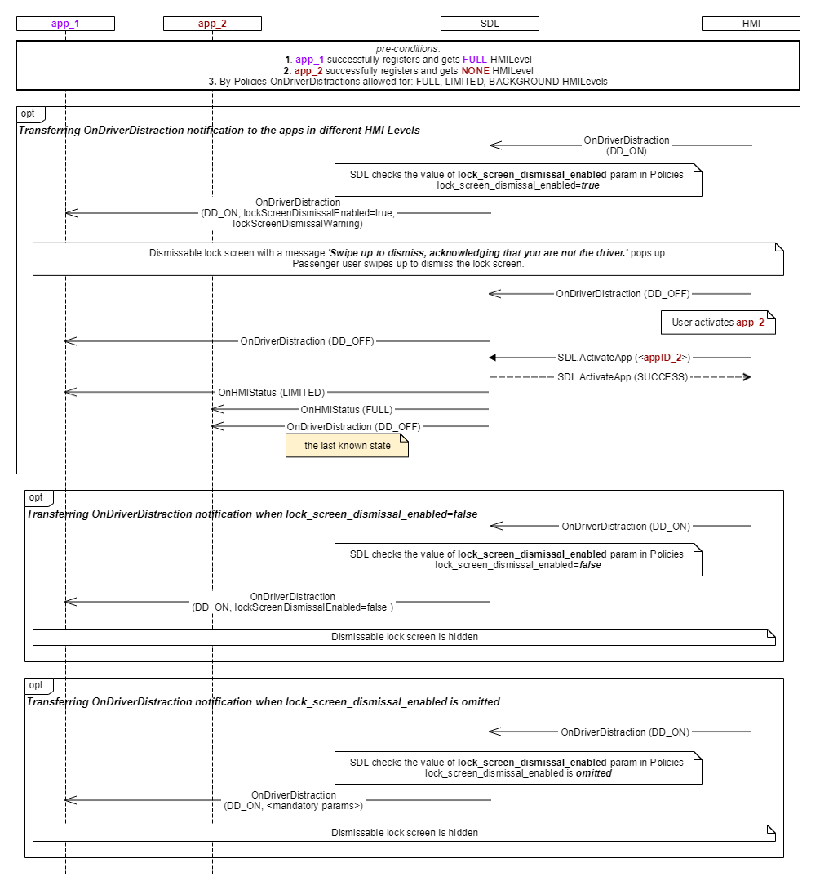

## Functional requirements

1. 
Driver distraction rules (if active) are expected to be configurable on HMI for each platform.  
HMI must inform SDL via OnDriverDistraction whenever the driver distraction mode is activated/deactivated on HMI.  

Important Note: DD rules are not applicable to SDL functionality, but describes platform (head unit) configuration and driver distraction restrictions to display or operate some functionality on HMI.  
Driver distraction rules may be specific to contry/area, so it depends on HMI when to trigger activate/deactivate states.

For current HMI configuration, sub-menu opening and and ScrollableMessage operating are not available duringh DD ON mode. HMI may notify user about DD mode enabling-disabling.

2. 
In case  
HMI notifies SDL about current DriverDistraction mode ON/OFF via OnDriverDistraction notification  

SDL must  

transfer OnDriverDistraction notification with all mandatory fields to all applications being registered to SDL

_Information:_
_Whether the app receives the notification in current HMILevel is defined by app's assigned Policies._

3.  
In case
mobile app registers and gets NONE HMI Level
and SDL receives OnDriverDistraction (`<state>`) fom HMI

SDL must  

transfer the last known (actual) OnDriverDistraction (`<state>`) and to this mobile app right after this mobile app changes HMILevel to any other than NONE

4. 
In case  
Policy DB has `lock_screen_dismissal_enabled=true`
HMI sends OnDriverDistraction (ON) to SDL 
and mobile app successfully connects on SDL and gets any HMI Level except NONE

SDL must  

transfer OnDriverDistraction notification with `state=DD_ON` and `lockScreenDismissalEnabled=true` to this connected app 

5.  
In case  
HMI sends invalid notification that SDL should transfer to mobile app  

SDL must 

log the issue and ignore this notification

Information:  
Invalid notifications means the notification contains:  
a. params out of bounds or incorrect symbols (/t, /n, `<whitespace>`)  
b. mandatory params are missing  
c. params of wrong type  
d. invalid json  
e. incorrect combination of params

6. 
In case
Policy DB has `lock_screen_dismissal_enabled=true`
Policy allows a mobile app to receive OnDriverDistraction notification in current HMI level
HMI sends a valid OnDriverDistraction notification with `state=DD_ON` to SDL

SDL must
transfer OnDriverDistraction notification with `state=DD_ON` and `lockScreenDismissalEnabled=true` to the mobile app

7.  
In case
Policy DB has `lock_screen_dismissal_enabled=false`
Policy allows a mobile app to receive OnDriverDistraction notification in current HMI level
and HMI sends a valid OnDriverDistraction notification with `state=DD_ON` to SDL

SDL must
transfer OnDriverDistraction notification with `state=DD_ON` and `lockScreenDismissalEnabled=false` to the mobile app

8.  
In case
Policy DB does not have `lock_screen_dismissal_enabled` defined
Policy allows a mobile app to receive OnDriverDistraction notification in current HMI level
HMI sends a valid OnDriverDistraction notification to SDL

SDL must
transfer OnDriverDistraction notification without lockScreenDismissalEnabled to the mobile app

9.  
In case
Initially policy DB does not have lock_screen_dismissal_enabled defined,
After PTU lock_screen_dismissal_enabled is updated,
Policy allows a mobile app to receive OnDriverDistraction notification in current HMI level
HMI sends a valid OnDriverDistraction notification with state=DD_ON to SDL

SDL must
transfer OnDriverDistraction notification with state=DD_ON and lockScreenDismissalEnabled=value in policy to the mobile app

## Non-functional requirements
1. New `lockScreenDismissalEnabled` parameter must be added to Mobile_API

```
    <function name="OnDriverDistraction" functionID="OnDriverDistractionID" messagetype="notification" since="1.0">
        <description>Provides driver distraction state to mobile applications</description>
        <param name="state" type="DriverDistractionState" mandatory="true">
            <description>Current State of Driver Distraction</description>
        </param>
    </function>
    <!-- newly added parameter -->
    <param name="lockScreenDismissalEnabled" type="Boolean" mandatory="false">
    <description>
      If enabled, the lock screen will be able to be dismissed while connected to SDL, allowing users 
      the ability to interact with the app. Dismissals should include a warning to the user and ensure 
      that they are not the driver.
    </description>
  </param>
 ```  
 
2. HMI_API
```
  <function name="OnDriverDistraction" messagetype="notification">
    <description>Notification must be sent from HMI to SDL when driver distraction state is changed. Driver distraction rules are defined by the platform.</description>
    <param name="state" type="Common.DriverDistractionState" mandatory="true">
      <description>See DriverDistractionState. </description>
    </param>
  </function>
``` 
3. PolicyTable must support new `lock_screen_dismissal_enabled` parameter set by default as 'true' to module_config section of PT.
```
{
    "policy_table": {
        "module_config": {
            "preloaded_pt": true,
            "exchange_after_x_ignition_cycles": 100,
            "exchange_after_x_kilometers": 1800,
            "exchange_after_x_days": 30,
            "timeout_after_x_seconds": 60,
            "seconds_between_retries": [1,
            5,
            25,
            125,
            625],
            "lock_screen_dismissal_enabled": true
  ```

## Diagram
OnDriverDistraction

