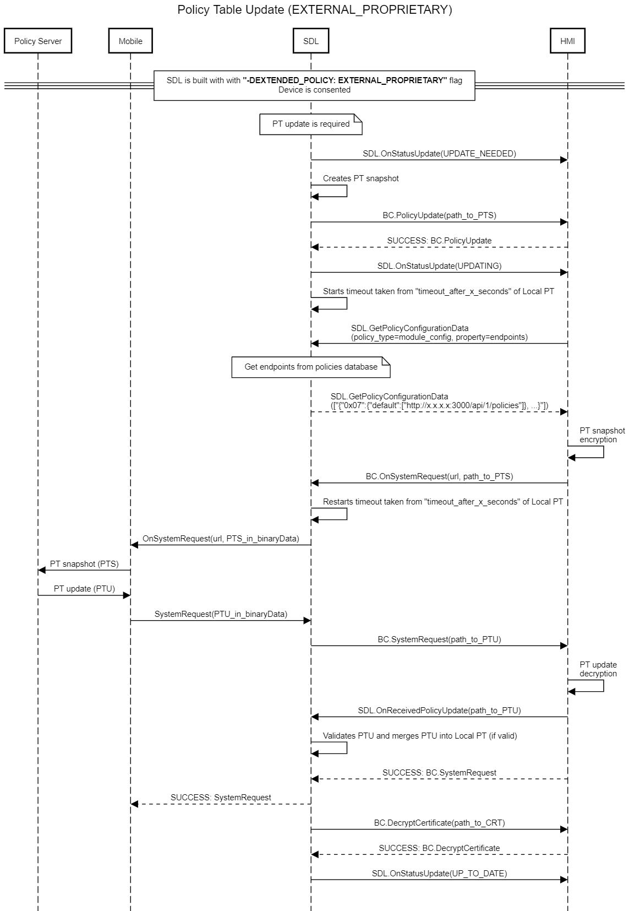

## Policy Table Update Sequence

### **Notification on PTU request**
1.

SDL must 

notify HMI via SDL.OnStatusUpdate(UPDATE_NEEDED) on any PTU trigger

**Exception: No notification should be sent on user requested PTU from HMI (via SDL.UpdateSDL request)**

### **Policy Table Snapshot creation**
2. 
To create Policy Table Snapshot 

SDL must

copy the Local Policy Table into memory and remove `messages` sub-section from `consumer_friendly_messages` section (See data dictionary for more details).

_Information:_  
a. The Policy Table Snapshot represents a Local Policy Table at a particular moment-in-time.  
b. `messages` sub-section is excluded from PTS with the purpose to limit the size of a request payload.


2.1

To create Policy Table Snapshot 

SDL must 

include `schema_version` while requesting the policy update 

_Information:_  
a. Policy server would compare the schema version received from cloud with what is available on server. Based on this comparison, vehicle data schema update would be sent in policy update response.

2.2

SDL must 

include `schema_version` in `vehicle_data` only if `schema_items` schema is included

Note: snapshot shall not include full details of `schema_items` within `vehicle_data`

### PTS storage on a file system
3. 
	
SDL must 

store the PT snapshot as a JSON file which filename is defined in `PathToSnapshot` parameter of smartDeviceLink.ini file

```
[Policy]
...
PathToSnapshot = sdl_snapshot.json
```

Note: filepath is defined in "SystemFilesPath"

### Sending path to Policy Table Snapshot to HMI
4. 
In case

PolicyTableUpdate is triggered

SDL must 

send BC.PolicyUpdate (path to SnapshotPolicyTable) to HMI for future PTS encryption and sending to backend

5.
Upon receiving BC.PolicyUpdate (SUCCESS) response from HMI

SDL must 

- change the status from `UPDATE_NEEDED` to `UPDATING` 
- and notify HMI with OnStatusUpdate(`UPDATING`)

###  Lookup the appropriate "timeout" for getting PTU
6.
Upon sending OnStatusUpdate(`UPDATING`) to HMI 

SDL must

start timeout to wait for a response on PTU (taken from `timeout_after_x_seconds` field of LocalPT) 

### Handling HMI request for policy configuration data
7. 
In case 

HMI sends a request via SDL.GetPolicyConfigurationData("module_config", property = "endpoints")

SDL must  

respond with the list of pairs URLs taken from Local PT and appropriate internal appIDs (if exist) only for the applications being now connected to SDL.

### Getting urls PTS should be transfered to in case there is no application connected
8. 
To get the urls PTS should be transfered to

SDL must

refer `module_config` section > `endpoints` sub-section > parent key `0x07`> key `default` in case there's no application connected at the moment.

Example of PT section
```
 "endpoints": {
        "0x07": {
          "default": [
            "http://policies.telematics.ford.com/api/policies", 
              "http://cloud.ford.com/global"
          ]
```

### Getting urls PTS should be transfered to (an app is registered)
9. 
To get the urls PTS should be transfered to

SDL must

refer PTS `endpoints` section, key `0x07`> key `default` and key(s) app id which correspond to policyAppID(s) of the application(s) being connected to SDL now. The values must be provided in SDL.GetPolicyConfigurationData(`endpoints`) response.

Example of PT
```
 "endpoints": {
        "0x07": {
          "default": [
            "http://policies.telematics.ford.com/api/policies"
          ], 
             "123": [
            "http://policies.telematics.ford.com/api/policies", 
            "http://policies.somedomain.ford.com/api/policies", 
            "http://policies.anotherdomain.ford.com/api/policies", 
          ]
        }
      }
 ```
 
### Sending Policy Table Snapshot from SDL to backend/mobile application
10. 
When got from SyncP, 

SDL must 

forward OnSystemRequest(request_type=PROPRIETARY, url, timeout, appID) with encrypted PTS snapshot as a hybrid data to mobile application with `appID` value.

Note1: In case OnSystemRequest() is sent with "default appID" number, SDL must forward the notification with encrypted PTS snapshot as a hybrid data to connected mobile application `appID`
Note2: SDL resends the `url` parameter to mobile app via OnSystemRequest only in case it receives `url` parameter within BasicCommunication.OnSystemRequest from SyncPManager (HMI_API).
If SyncP doesn't send any URLs to SDL, it is supposed that mobile application will sent Policy Table Update data back to SDL.

HMI Note1: It's HMI responsibility to encrypt PTS file and provide it to SDL via OnSystemRequest (HMI API `fileName` parameter).

HMI Note2: It's HMI responsibility to choose an application for sending PTU and start PTU timer or retry timer after sending OnSystemRequest to SDL.

HMI Note3: HMI is responsible for initiating retry sequence. (see also [PolicyTableUpdate_Retry_Sequence]()]

HMI Note4: HMI is responsible for removing Policy Table Snapshot when retry sequence is over.

### Sending Policy Table Snapshot to backend/mobile application (got appID as "default" from HMI)
11. 

SDL must

stop the timeout started right after sending OnStatusUpdate to HMI in case SDL.OnReceivedPolicyUpdate comes from HMI

### Processing a response from a backend
12. 
Upon receiving the response from the application via SystemRequest(requestType=PROPRIETARY)  

SDL must

- read hybrid data and store it by the path specified in smartDeviceLink.ini file under "SystemFilesPath" parameter
- notify HMI with SystemRequest(requestType=PROPRIETARY, fileName, appID) about PTU has been obtained

HMI Note1: It's HMI responsibility to decode and decrypt the contents of Policy Table Update  
HMI Note2: On decoding and decrypting the PTU, HMI must_notify SDL with SDL.OnReceivedPolicyUpdate(policyfile)  
HMI Note3: SDL generates the name for file with stored binary data by itself and add the Integer value to each <fileName>, e.g. `<1fileName>`(applicable for IVSU and PROPRIETARY requestTypes)
 
#### PTU Validation
13. 
After getting OnReceivedPolicyUpdate (`policyFile`) from HMI

SDL must
- stop timeout 
- validate the Policy Table Update (`policyFile`) according to Data Dictionary statuses of optional, required, or omitted:

1) Validation must reject a policy table update if it include fields with a status of ‘omitted’
2) Validation must reject a policy table update if it does not include fields with a status of ‘required’

Note1: In case section with required status "optional/omitted" is ommited in Updated PT, and a field of this section is marked as required, the validation of the mentioned field is not "required" (i.e. policy table must be considered as valid).

Note2: SDL shall ignore the unknown section/parameter in the updated PT.

14. 
Right after successful validation of received PTU

SDL must

change the status to UP_TO_DATE and notify HMI with OnStatusUpdate(UP_TO_DATE)

15. 
In case PTU validation fails

SDL must

- log the error locally
- discard the Policy Table Update with No notification of Cloud about invalid data
- notify HMI with OnStatusUpdate(UPDATE_NEEDED)

### Applying of the VehicleDataItems from PTU
16. 

In case
preloaded file contains VehicleDataItems for all RPC spec VehicleData
and PTU is performed with VehicleDataItems in update file

SDL must
- apply the update, saves it to DB
- send OnPermissionChange with updated `VehicleData` to mobile app

_Info_  
a. VehicleDataItem - is the vehicle data item in question. e.g. gps, speed etc. SDL core would use this as the vehicle data param for requests from the app and to validate policies permissions.

b. VehicleData item availability and definitions in the official SDL RPC Spec will always take precedence over custom ("proprietary") parameters.

c. VehicleData items in the official SDL RPC Spec are immutable and therefore cannot be extended with proprietary data.

d. All VehicleData items must be defined in the Policy Table (not just the custom/proprietary items), per recommendation by PM's Core team.

17. 

In case in a PTU

there is custom data item that uses an enum that is not defined in a module's local RPC Spec

SDL must 
- perform NO validation on this parameter
- pass enum data types as a raw string between the HMI and mobile device

#### OEM Network Mapping table and Vehicle Data Schema versioning
18. 

In case 

PTU contains OEM Network Mapping table

SDL must 

persist OEM Network Mapping version in local policy DB

_Info_

a. **OEM Network Mapping version** - is version variable for OEM Network Mapping table located in `module_config` -> `endpoint_properties`

b. HMI needs to be able to read **OEM Network Mapping table version** value on demand so that it can control if and when to download the **OEM Network Mapping table**. HMI will utilize the _endpoint_ for OEM Network Mapping table file to download this file using _SystemRequest_ `requestType` _OEM_SPECIFIC_ and `requestSubType` _VEHICLE_DATA_MAPPING_. OEM Network Mapping table file would have _endpoint_ key (service) as _custom_vehicle_data_mapping_url_.

Example for OEM Network Mapping table file `endpoint` and `version` in PTU

```
{  
   "module_config":{  
      "full_app_id_supported":true,
      "exchange_after_x_ignition_cycles":100,
      "exchange_after_x_kilometers":1800,
      "exchange_after_x_days":30,
      "timeout_after_x_seconds":60,
      "seconds_between_retries":[  
         1,
         5,
         25,
         125,
         625
      ],
      "endpoints":{  
         "0x07":{  
            "default":[  
               "http://192.168.1.143:3001/api/v1/staging/policy"
            ]
         },
         "0x04":{  
            "default":[  
               "http://localhost:3000/api/1/softwareUpdate"
            ]
         },
         "queryAppsUrl":{  
            "default":[  
               "http://localhost:3000/api/1/queryApps"
            ]
         },
         "lock_screen_icon_url":{  
            "default":[  
               "https://i.imgur.com/TgkvOIZ.png"
            ]
         },
         "custom_vehicle_data_mapping_url":{  
            "default":[  
               "http://localhost:3000/api/1/vehicleDataMap"
            ]
         }
      },
      "endpoint_properties":{  
         "custom_vehicle_data_mapping_url":{  
            "version":"0.1.2"
         }
      },
      "notifications_per_minute_by_priority":{  
         "EMERGENCY":60,
         "NAVIGATION":15,
         "VOICECOM":20,
         "COMMUNICATION":6,
         "NORMAL":4,
         "NONE":0
      }
   }
}
```

19. 

In case 

PTU does not contain OEM Network Mapping table

SDL must

- treat the PTU as invalid
- notify HMI with OnStatusUpdate(UPDATE_NEEDED)

20. 

In case

VehicleDataItems are changed/updated during PTU

PTU must contain `schema_items` and `schema_version`

21. 

`schema_version` must be included in `vehicle_data` only if `schema_items` schema is included

22. 

In case 

`schema_version` is not included in PTU

SDL must 

skip the `schema_items` update


#### vehicle data schema update
23. 

In case in a PTU

`schema_items` key does not exist

SDL must

not update `schema_items` local schema/items

24. 

In case in a PTU

`schema_items` is present

SDL must

replace all local schema VehicleDataItems with new ones except the ones defined in RPC spec

25. 

In case in a PTU

`schema_items` is present but empty

SDL must

remove all local schema VehicleDataItems except the ones defined in RPC spec

26. 

In case in a PTU

`schema_items` has item with same name as one of the VehicleDataItems defined in RPC spec

SDL must

ignore those data items

#### PTU merge
#### PTU merge into Local Policy Table
27. 

In case of successful PTU validation   

SDL must 

replace the following sections of the Local Policy Table with the corresponding sections from PTU:
* `module_config`,
* `functional_groupings`,
* `app_policies`

28. 

In case 

the `consumer_friendly_messages` section of PTU contains a `messages` subsection  

SDL must

replace the `consumer_friendly_messages` portion of the Local Policy Table with the same section from PTU

29. 
In case 

the Updated PT omits `consumer_friendly_messages` section  

SDL must

maintain the current `consumer_friendly_messages` section in Local PT.

#### PTU file removal on PTU sequence end
30. 
	
Policies Manager must delete the file with Policy Table Update (got by SDL.OnReceivedPolicyUpdate) for the both cases:

1) After successful merge Policy Table Update into Local Policy Table
or
2) Validation failure against Data Dictionary

#### DecryptCertificate
31. 
In case 

SDL gets an Updated PT with non-empty "certificate" field  

SDL must 

- copy the value from "certificate" field to the file named "certificate" and
- store it in the folder defined by existing `AppStorageFolder` param

32. 
In case 

SDL stores the `certificate` file

SDL must 

send BC.DecryptCertificate_request with the path to `certificate` file to HMI

33. 
In case 

SDL receives successful BC.DecryptCertificate_response from HMI  

SDL must 
copy the decrypted certificate from the file to the "certificate" field of the policy database

34. 
In case 

SDL has copied the decrypted certificate from the file to the "certificate" field of the policy database 

SDL must 

remove the file

## Diagrams

