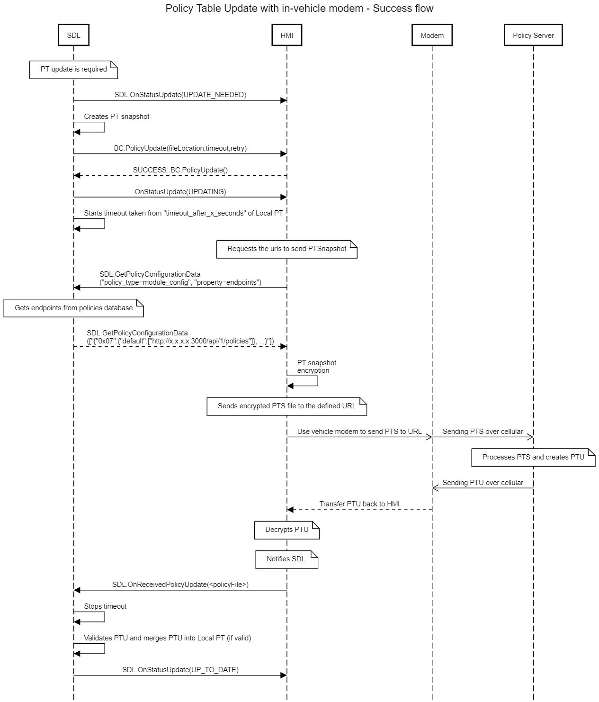

## PROPRIETARY Policy Table Update Sequence

##  Sending Policy Table Snapshot from SDL to backend

### **Notification on PTU request**
1.

SDL must 

notify HMI via SDL.OnStatusUpdate(UPDATE_NEEDED) on any PTU trigger

_Note: the source of the PolicyTableUpdate is the Policies Cloud._


2. 	

To create Policy Table Snapshot 

SDL must

copy the Local Policy Table into memory and remove `messages` sub-section from `consumer_friendly_messages` section (See data dictionary for more details).

_Information:_  
a. The Policy Table Snapshot represents a Local Policy Table at a particular moment-in-time.  
b. `messages` sub-section is excluded from PTS with the purpose to limit the size of a request payload.

2.1

To create Policy Table Snapshot 

SDL must 

include `schema_version` while requesting the policy update 

_Information:_  
a. Policy server would compare the schema version received from cloud with what is available on server. Based on this comparison, vehicle data schema update would be sent in policy update response.

2.2

SDL must 

include `schema_version` in `vehicle_data` only if `schema_items` schema is included

Note: snapshot shall not include full details of `schema_items` within `vehicle_data`

### Sending path to Policy Table Snapshot to HMI
3. 	

In case

PolicyTableUpdate is triggered 

SDL must
send BC.PolicyUpdate (`path to SnapshotPolicyTable`, `timeout from policies`, `set of retry timeouts`) to HMI

4. 

Upon receiving BC.PolicyUpdate (SUCCESS) response from HMI

SDL must

- change the status from `UPDATE_NEEDED` to `UPDATING` 
- and notify HMI with OnStatusUpdate(`UPDATING`)  


###  Lookup the appropriate "timeout" for getting PTU
5.
Upon sending OnStatusUpdate(`UPDATING`) to HMI 

PoliciesManager must 

start timeout to wait for a response on PTU (taken from `timeout_after_x_seconds` field of LocalPT) 

6. 

To define the timeout to wait for a response on PTU

SDL must

refer PTS `module_config` section, key `timeout_after_x_seconds`

Example of PT:
```
 "module_config": {
      "preloaded_pt": true,
      "vehicle_make": "",
      "vehicle_model": "",
      "vehicle_year": "",
      "exchange_after_x_ignition_cycles": 100,
      "exchange_after_x_kilometers": 1800,
      "exchange_after_x_days": 30,
      "timeout_after_x_seconds": 60,
      "seconds_between_retries": [
        1,
        5,
        25,
        125,
        625
      ],
```

### Handling HMI request for policy configuration data
7. 

In case

SDL gets SDL.GetPolicyConfigurationData (service: 7) from HMI

SDL must

respond SDL.GetPolicyConfigurationData_response (SUCCESS, "module_config", property = "endpoints") to HMI

_Information_
Related policies section:
```
      "endpoints": {
        "0x07": {
          "default": [
            "http://policies.url.com"
          ]
        }
      },
```

Example of PT with `<app id>`:
```
 "endpoints": {
        "0x07": {
          "default": [
            "http://policies.telematics.ford.com/api/policies"
          ], 
             "123": [
            "http://policies.telematics.ford.com/api/policies", 
            "http://policies.somedomain.ford.com/api/policies", 
            "http://policies.anotherdomain.ford.com/api/policies", 
          ]
        }
      }
```

### HMI chooses to process PTU via mob app

8.

In case

HMI sends BC.OnSystemRequest (PROPRIETARY, fileName: `<path to Snapshot`>, url, appID)

SDL must
- add field with HTTP Headers data
- send OnSystemRequest to the specified `appID` app with Snapshot and Binary Header (below) in payload to mobile app

```
 {
	"HTTPRequest": {
		"headers": {
			"ContentType": "application/json",
			"ConnectTimeout": <int value from policy table:timeout_after_x_seconds>,
			"DoOutput": true,
			"DoInput": true,
			"UseCaches": false,
			"RequestMethod": "POST",
			"ReadTimeout": <int value from policy table:timeout_after_x_seconds>,
			"InstanceFollowRedirects": false,
			"charset": "utf-8",
			"Content_Length": <value of the length of the "body" string>
		},
		"body": "{"data":["this is either the syncp packet or raw policy table BgcYTArvdz62FO7yHgOTXtE3EP0E0WsbFeDqzYY="]}"
	}
}
```

_Information_

a. OnSystemRequest with SnapshotPT (= binary data) should be sent over "Bulk" Service (15) to mobile app


9. 

SDL must

randomly select the application through which to send the Policy Table packet
and request an update to its Local Policy Table only through apps with HMI status of BACKGROUND, LIMITED, and FULL.


If there are no mobile apps with any of these statuses, the system must use an app with an HMI Level of NONE.


10. 
In case 

BC.OnSystemRequest is received from HMI within the timeout (taken from `timeout_after_x_seconds` field of LocalPT) 

SDL must

- restart the timeout (taken from `timeout_after_x_seconds` field of LocalPT)
- send OnSystemRequest with SnapshotPT to mobile app

### Processing a response from a backend

11. 	
In case  
SDL has sent OnSystemRequest with SnapshotPT to mobile app  
and SDL gets SystemRequest with UpdatedPT in payload during `timeout_after_x_seconds` value taken from Policy Database and started after OnSystemRequest sending out to mobile app

SDL must

send BasicCommunication.SystemRequest (`<path to UpdatedPT>`, PROPRIETARY, params) to HMI

_Information_

a. Path for SDL to store the UpdatedPT is defined by `SystemFilesPath` (value defined in [SmartDeviceLink.ini. file]((https://github.com/smartdevicelink/sdl_core/blob/develop/src/appMain/smartDeviceLink.ini)))  
b. UpdatedPT is not applied by SDL until OnReceivedPolicyUpdate notification from HMI  
c. SDL should expect SystemRequest with UpdatedPT (= binary data) over "Bulk" Service (15) from mobile app  
d. If SystemRequest is not received during `timeout_after_x_seconds`, SDL should start the "Retry Sequence" 

12. 

In case  
SDL has sent BasicCommunication.SystemRequest to HMI  
and SDL gets BasicCommunication.SystemRequest_response (`<resultCode>`) during "SDL timeout for HMI requests" (= 10 sec by default) from HMI

SDL must
send SystemRequest_response (`<resultCode from HMI response>`) to mobile app

_Information_  
a. If SDL's timeout is expired with no response from HMI, SDL responds with GENERIC_ERROR to mobile app

13. 
In case  
SDL gets SDL.OnReceivedPolicyUpdate (`<path to UpdatedPT>`) from HMI

SDL must  
apply the valid UpdatedPT to Policy Database

#### PTU Validation

14. 

Right after successful validation of received PTU

SDL must

change the status to `UP_TO_DATE` and notify HMI with OnStatusUpdate(`UP_TO_DATE`)

15. 

In case PTU validation fails

SDL must 
- log the error locally
- discard the Policy Table Update with No notification of Cloud about invalid data
- notify HMI with OnStatusUpdate(UPDATE_NEEDED)

### Applying of the VehicleDataItems from PTU
16. 

In case  
preloaded file contains `vehicle_data` for all RPC spec VehicleData  
and PTU is performed with `vehicle_data` in update file

SDL must
- apply the update, saves it to DB
- send OnPermissionChange with updated allowed parameters for the vehicle data defined in the `vehicle_data` to the app that is allowed to access those vehicle data parameters

_Info_  
a. VehicleDataItem - is the vehicle data item in question. e.g. gps, speed etc. SDL core would use this as the vehicle data param for requests from the app and to validate policies permissions.

b. VehicleData item availability and definitions in the official SDL RPC Spec will always take precedence over custom ("proprietary") parameters.

c. VehicleData items in the official SDL RPC Spec are immutable and therefore cannot be extended with proprietary data.

d. All VehicleData items must be defined in the Policy Table (not just the custom/proprietary items), per recommendation by PM's Core team.

17. 

In case in a PTU

there is custom data item that uses an enum that is not defined in a module's local RPC Spec

SDL must 
- perform NO validation on this parameter
- pass enum data types as a raw string between the HMI and mobile device

#### OEM Network Mapping table and Vehicle Data Schema versioning
18. 

In case 

PTU contains OEM Network Mapping table version

SDL must 

persist OEM Network Mapping version in local policy DB

_Info_

a. **OEM Network Mapping version** - is version variable for OEM Network Mapping table located in `module_config` -> `endpoint_properties` -> `custom_vehicle_data_mapping_url`

b. HMI needs to be able to read **OEM Network Mapping table version** value on demand so that it can control if and when to download the **OEM Network Mapping table**.  
HMI will utilize the endpoint for OEM Network Mapping table file to download this file using _SystemRequest_ `requestType` _OEM_SPECIFIC_ and `requestSubType` _VEHICLE_DATA_MAPPING_. OEM Network Mapping table file would have _endpoint_ key (service) as _custom_vehicle_data_mapping_url_.

Example for OEM Network Mapping table file `endpoints` and `version` in PTU

```
{  
   "module_config":{  
      "full_app_id_supported":true,
      "exchange_after_x_ignition_cycles":100,
      "exchange_after_x_kilometers":1800,
      "exchange_after_x_days":30,
      "timeout_after_x_seconds":60,
      "seconds_between_retries":[  
         1,
         5,
         25,
         125,
         625
      ],
      "endpoints":{  
         "0x07":{  
            "default":[  
               "http://192.168.1.143:3001/api/v1/staging/policy"
            ]
         },
         "0x04":{  
            "default":[  
               "http://localhost:3000/api/1/softwareUpdate"
            ]
         },
         "queryAppsUrl":{  
            "default":[  
               "http://localhost:3000/api/1/queryApps"
            ]
         },
         "lock_screen_icon_url":{  
            "default":[  
               "https://i.imgur.com/TgkvOIZ.png"
            ]
         },
         "custom_vehicle_data_mapping_url":{  
            "default":[  
               "http://localhost:3000/api/1/vehicleDataMap"
            ]
         }
      },
      "endpoint_properties":{  
         "custom_vehicle_data_mapping_url":{  
            "version":"0.1.2"
         }
      },
      "notifications_per_minute_by_priority":{  
         "EMERGENCY":60,
         "NAVIGATION":15,
         "VOICECOM":20,
         "COMMUNICATION":6,
         "NORMAL":4,
         "NONE":0
      }
   }
}
```

19. 

In case 

PTU does not contain OEM Network Mapping table version

SDL must

- treat the PTU as invalid
- notify HMI with OnStatusUpdate(UPDATE_NEEDED)

20. 

In case

VehicleDataItems are changed/updated during PTU

PTU must contain `schema_items` and `schema_version`

21. 

`schema_version` must be included in `vehicle_data` only if `schema_items` schema is included

22. 

In case 

`schema_version` is not included in PTU

SDL must 

skip the `schema_items` update


#### vehicle data schema update
23. 

In case in a PTU

`schema_items` key does not exist

SDL must

not update `schema_items` local schema/items

24. 

In case in a PTU

`schema_items` is present

SDL must

replace all local schema VehicleDataItems with new ones except the ones defined in RPC spec

25. 

In case in a PTU

`schema_items` is present but empty

SDL must

remove all local schema VehicleDataItems except the ones defined in RPC spec

26. 

In case in a PTU

`schema_items` has item with same name as one of the VehicleDataItems defined in RPC spec

SDL must

ignore those data items


#### PTU merge

27. 

In case of successful PTU validation   

SDL must 

replace the following sections of the Local Policy Table with the corresponding sections from PTU:
* `module_config`,
* `functional_groupings`,
* `app_policies`

28. 

In case 

the `consumer_friendly_messages` section of PTU contains a `messages` subsection  

SDL must

replace the `consumer_friendly_messages` portion of the Local Policy Table with the same section from PTU


## Diagrams

### PROPRIETARY - PTU using mob app  


### PROPRIETARY - PTU using in-vehicle modem 




