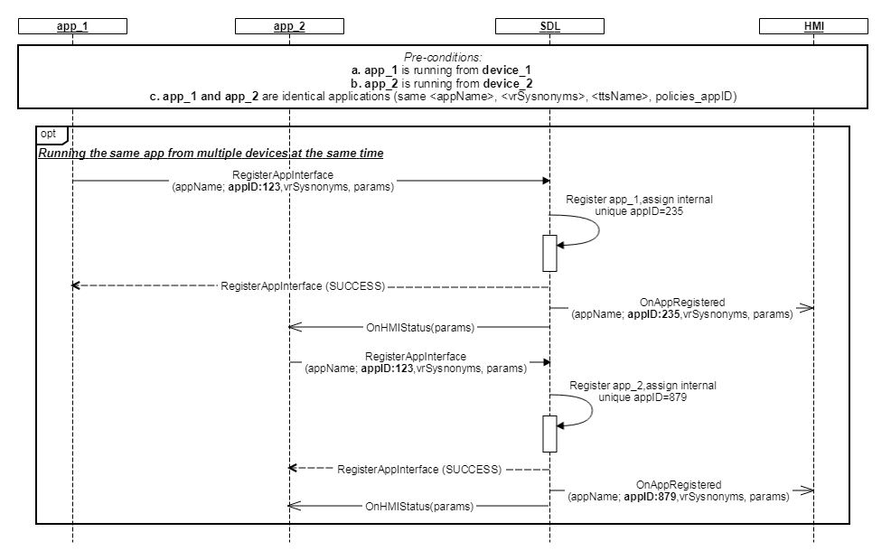

## Functional requirements

### Registering two identical apps from 2 devices

1.  
In case  
application with `<appName>` and `<appID>` is registered with SDL from device_1  
and another application with **the same** `<appName>` and **the same** `<appID>` from device_2 requests registration 

SDL must  
allow this second app registration  
respond with RegisterAppInterface (resultCode: SUCCESS, success: true, params) to app  
and notify HMI via BC.OnAppRegistered

2.  
In case  
application with `<appName>` and `<appID>` is registered with SDL from device_1  
and another application with **the same** `<appName>` and **different** `<appID>` from device_2 requests registration 

SDL must  
allow this second app registration  
respond with RegisterAppInterface (resultCode: SUCCESS, success: true, params) to app 
and notify HMI via BC.OnAppRegistered 
 
3.  
In case  
application with `<appName>` and `<appID>` is registered with SDL from device_1  
and another application with **different** `<appName>` and **the same** `<appID>` from device_2 requests registration 

SDL must  
allow this second app registration  
respond with RegisterAppInterface (resultCode: SUCCESS, success: true, params) to app  
and notify HMI via BC.OnAppRegistered 

### Registering two identical apps from the same mobile device

4.  
In case 
app_1 with `<appName>` and `<appID>` is registered with SDL from device_1  
and app_2 with **the same** `<appName>` and **the same** `<appID>` from **the same device_1** requests registration

SDL must  
reject app_2 registration request  
respond with RegisterAppInterface (resultCode = APPLICATION_REGISTERED_ALREADY) to app_2

5.  
In case  
app_1 with `<appName>` and `<appID>`  is registered with SDL from device_1
and app_2 with **the same** `<appName>` and **different** `<appID>` **from the same device_1** requests registration

SDL must  
reject app_2 registration request  
respond with RegisterAppInterface (resultCode = DUPLICATE_NAME) to app_2

6.  
In case 
app_1 with `<appName>` and `<appID>`  is registered with SDL from device_1
and app_2 with **different** `<appName>` and **the same** `<appID>` **from the same device_1** requests registration

SDL must  
reject the second app registration request (that is, respond with RegisterAppInterface (resultCode = APPLICATION_REGISTERED_ALREADY) reject app_2 registration request  
respond with RegisterAppInterface (resultCode = APPLICATION_REGISTERED_ALREADY) to app_2
 
### Registering the same app from multiple devices  

7.  
In case  
app_1 with `<appName>` and `<appID>` is registered with SDL from device_1  
and app_2 with **the same** `<appName>` as app_1 and **the same** `<appID>` from **device_2** requests registration  

SDL must  
assign unique internal `<appID>` to app_2  
notify HMI via BC.OnAppRegistered  
respond with RegisterAppInterface (resultCode = SUCCESS) to app_2

8.  
In case  
app_1 with `<appName>` and `<appID>` is registered with SDL from device_1  
and app_2 with **the same** `appName` as app_1 and **different** `appID` from **device_2** requests registration  

SDL must  
notify HMI via BC.OnAppRegistered  
respond with RegisterAppInterface (resultCode = SUCCESS) to app_2

9.  
In case  
app_1 with `<appName>` and `<appID>` is registered with SDL from device_1  
and app_2 with **different** `<appName>` and **the same** `<appID>` from **device_2** requests registration  

SDL must  
assign unique internal `<appID>` to app_2  
notify HMI via BC.OnAppRegistered  
respond with RegisterAppInterface (resultCode = SUCCESS) to app_2

## Non-functional requirements  
### Mobile API description updates

```xml
<param name="appName" type="String" maxlength="100" mandatory="true" since="1.0">
    <description>
        The mobile application name, e.g. "Ford Drive Green".
-        Needs to be unique over all applications.
+        Needs to be unique over all applications from the same device.
        May not be empty.
        May not start with a new line character.
-        May not interfere with any name or synonym of previously registered applications and any predefined blacklist of words (global commands)
+        May not interfere with any name or synonym of previously registered applications from the same device and any predefined blacklist of words (global commands)
-        Needs to be unique over all applications. Applications with the same name will be rejected.
+        Additional applications with the same name from the same device will be rejected.
       Only characters from char set [@TODO: Create char set (character/hex value) for each ACM and refer to] are supported.
    </description>
</param>
```

```xml
<param name="ttsName" type="TTSChunk" minsize="1" maxsize="100" array="true" mandatory="false" since="2.0">
    <description>
        TTS string for VR recognition of the mobile application name, e.g. "Ford Drive Green".
        Meant to overcome any failing on speech engine in properly pronouncing / understanding app name.
-       Needs to be unique over all applications.
+       Needs to be unique over applications from the same device.
        May not be empty.
        May not start with a new line character.
        Only characters from char set [@TODO: Create char set (character/hex value) for each ACM and refer to] are supported.
    </description>
</param>
```

```xml
<param name="vrSynonyms" type="String" maxlength="40" minsize="1" maxsize="100" array="true" mandatory="false" since="1.0">
    <description>
        Defines an additional voice recognition command.
-        May not interfere with any app name of previously registered applications and any predefined blacklist of words (global commands)
+        May not interfere with any app name of previously registered applications from the same device and any predefined blacklist of words (global commands)
        Only characters from char set [@TODO: Create char set (character/hex value) for each ACM and refer to] are supported.
    </description>
</param>
```

### HMI API description updates

```xml
<param name="appName" type="String" maxlength="100" mandatory="false">
    <description>
        Request new app name registration
-        Needs to be unique over all applications.
+        Needs to be unique over all applications from the same device.
        May not be empty. May not start with a new line character.
-        May not interfere with any name or synonym of any registered applications.
+        May not interfere with any name or synonym of any registered applications form the same device.
-        Applications with the same name will be rejected. (SDL makes all the checks)
+        Additional applications with the same name from the same device will be rejected.
    </description>
</param>
```

```xml
<param name="vrSynonyms" type="String" maxlength="40" minsize="1" maxsize="100" array="true" mandatory="false">
  <description>
	Request new VR synonyms registration
	Defines an additional voice recognition command.
-    Must not interfere with any name of previously registered applications(SDL makes check).
+    Must not interfere with any name of previously registered applications from the same device.
  </description>
</param>
```

## Diagrams

Running the same app from multiple devices at the same time

